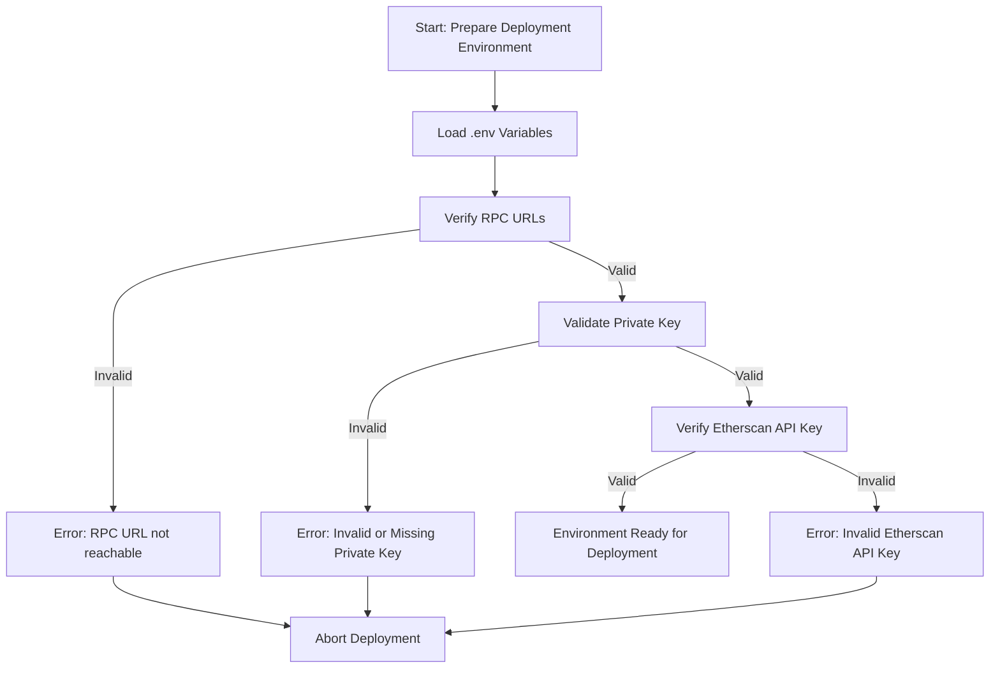

# Deployment Prerequisites

Setting up the deployment environment for the Aave Vault requires careful preparation of environment variables, credentials, and network endpoints. This chapter guides you through the essential `.env` configuration parameters that empower a secure and smooth deployment process across mainnet and testnet environments.

---

## 1. Overview of Environment Variables

The Aave Vault deployment scripts rely heavily on environment variables to maintain flexibility and security. These variables include RPC URLs for blockchain nodes, private keys for signing transactions, and API keys for contract verification services.

Your `.env` file serves as the central source to configure all sensitive and endpoint-related parameters without hardcoding them in scripts.

---

## 2. Required Environment Variables

### Core Variables

| Variable Name           | Description                                                  | Mandatory | Example Value                                  |
|------------------------|--------------------------------------------------------------|-----------|-----------------------------------------------|
| `RPC_URL_MAINNET`       | JSON RPC endpoint URL for Ethereum Mainnet or target mainnet | Yes       | `https://mainnet.infura.io/v3/YOUR-PROJECT-ID` |
| `RPC_URL_TESTNET`       | JSON RPC endpoint for the respective testnet (e.g., Mumbai)  | Yes       | `https://rpc-mumbai.maticvigil.com`            |
| `PRIVATE_KEY`           | Hexadecimal private key used to sign deployment transactions | Yes       | `0xabcdef1234...`                              |
| `ETHERSCAN_API_KEY`     | API key for contract verification on Etherscan or Polygonscan | Yes       | `YOUR_ETHERSCAN_API_KEY`                        |

### Optional Variables

If deploying on multiple networks or with advanced parameters, you may add:

- `REFERRAL_CODE` — numeric referral code for Aave pool interactions
- `PROXY_ADMIN_ADDRESS` — the deployer or proxy admin wallet address

---

## 3. Setting Up `.env` File

Create a `.env` file at your project root with the following sample template:

```env
# Mainnet RPC URL
RPC_URL_MAINNET=https://mainnet.infura.io/v3/YOUR-PROJECT-ID

# Testnet RPC URL (Mumbai, Polygon example)
RPC_URL_TESTNET=https://rpc-mumbai.maticvigil.com

# Deployer private key (Ensure this is kept secure!)
PRIVATE_KEY=0xYOUR_PRIVATE_KEY

# Etherscan or Polygonscan API key for verification
ETHERSCAN_API_KEY=YOUR_API_KEY

# Optional parameters
REFERRAL_CODE=0
PROXY_ADMIN_ADDRESS=0xYourProxyAdminAddress

```

<Tip>
Never commit your `.env` file or any private keys to public repositories. Use secure secrets management and follow your organization’s best security practices.
</Tip>

---

## 4. Network Endpoints and RPC URLs

Depending on your deployment target—mainnet or testnet—you need access to a reliable blockchain node provider. These endpoints allow your deployment scripts to communicate with the blockchain.

- **Mainnet:** Use providers like Infura, Alchemy, or QuickNode with your project-specific endpoint.
- **Testnet:** For example, Mumbai testnet RPC URLs are available from MaticVigil or public RPC providers.

Ensure the RPC node supports the full transaction pool and has good availability to prevent deployment interruptions.

---

## 5. Managing Private Keys and Credentials

### Private Key Usage

The private key specified in `PRIVATE_KEY` is used for signing deployment transactions. It should correspond to an account with sufficient funds on the target network.

### Security Best Practices

- Use environment variables or secured vaults instead of hardcoding keys.
- Consider hardware wallets or secure key management solutions when operating in production.
- Limit deployment key permissions strictly to deployment activities.

<Warning>
Exposure of the private key risks unauthorized asset control. Always store and handle keys securely.
</Warning>

---

## 6. Verifying Environment Setup

Before running deployment scripts, validate your `.env` configuration by performing these checks:

- Confirm your RPC URLs respond and allow sending transactions.
- Verify your private key corresponds to the correct deployer address.
- Test environment variables loading by printing sensitive values safely (e.g., hash or address only).

Example to quickly confirm via Foundry script environment variable access:

```bash
forge script script/Deploy.s.sol --broadcast --verify
```

Check console log output showing deployer address, balance, network chain ID, and RPC connectivity.

---

## 7. Common Pitfalls and Tips

- **Missing or incorrect RPC URLs:** Leads to deployment failures or timeouts.
- **Insufficient funds:** Ensure deployer accounts have enough native tokens to cover gas.
- **Unverified API keys:** Contract verification will fail without valid Etherscan/Polygonscan API keys.
- **Incorrect key format:** Private key should be a hex string prefixed with `0x`.

<Tip>
Validate each environment variable separately before starting deployment. Use testnet deployment for verification prior to mainnet.
</Tip>

---

## 8. Next Steps

After ensuring your environment variables are correctly set and verified, proceed to the [Configuring Deployment Parameters](./configuring-deployment-parameters) page to review the customizable options. Then, follow the [Running the Deployment Script](./running-the-deployment-script) guide to execute your vault deployment.

---

## References and Related Documentation

- [Configuration & Environment Setup](../../getting-started/configure-run-validate/configuration-setup)
- [Deploying Aave Vault](../../getting-started/configure-run-validate/deploying-vault)
- [Running the Deployment Script](./running-the-deployment-script)
- [Security Hardening Best Practices](../operational-excellence/security-hardening)

For source and examples, see the [Deploy.s.sol script on GitHub](https://github.com/aave/Aave-Vault/blob/main/script/Deploy.s.sol).

---

## Summary Diagram of Deployment Environment Setup



This flow captures the essential verification steps your deployment environment must pass before you proceed.

---

By carefully setting and verifying the environment variables as described, you establish a solid foundation for a secure, reliable deployment of the Aave Vault contract across both mainnet and testnet platforms.
