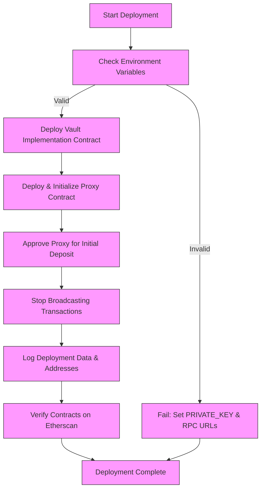

# Running the Deployment Script

This guide delivers a clear, step-by-step walkthrough for running the deployment script of the Aave Vault on both Polygon Mainnet and Mumbai Testnet. You will learn how to execute the deployment with broadcasting, verify contracts on Etherscan, understand recommended command line flags, and troubleshoot common issues encountered in live deployments.

---

## 1. Preparing to Deploy

Before you start the deployment script, ensure your environment is correctly configured with the necessary credentials and network settings.

### Prerequisites
- **Private Key:** Must be stored securely in your environment variables as `PRIVATE_KEY`. This key will be used to sign deployment transactions.
- **RPC URLs:** Access to Polygon Mainnet or Mumbai Testnet RPC endpoints configured in your environment.
- **Etherscan API Key:** Required for verification post-deployment (optional but highly recommended).

### Deployment Parameters Review
The deployment script `Deploy.s.sol` includes key parameters you must edit to suit your vault:

- **UNDERLYING_ASSET_ADDRESS:** The ERC-20 token address your vault will handle.
- **REFERRAL_CODE:** Aave referral code, if applicable.
- **AAVE_POOL_ADDRESSES_PROVIDER_ADDRESS:** Address of the Aave PoolAddressesProvider on your chain.
- **PROXY_ADMIN_ADDRESS:** Admin for the upgradeable proxy.
- **OWNER_ADDRESS:** The owner/manager of the vault.
- **SHARE_NAME & SHARE_SYMBOL:** The ERC-20 token representation of vault shares.
- **FEE:** Vault fee expressed in wad format (e.g., 0.1e18 for 10%).
- **INITIAL_LOCK_DEPOSIT:** An initial deposit amount to prevent frontrunning during deployment.

Make sure no parameter remains unset or zero, especially `INITIAL_LOCK_DEPOSIT`, which is critical for security.

<Tip>
Always validate your modified parameters locally before running live deployments to avoid costly mistakes.
</Tip>

## 2. Running the Deployment Script

### Basic Command
Use the [Foundry](https://book.getfoundry.sh/) `forge` CLI for deployment. Set your environment variables in `.env` (including `PRIVATE_KEY`) and run:

```bash
forge script script/Deploy.s.sol:Deploy --broadcast --chain-id <CHAIN_ID> [flags]
```

- Replace `<CHAIN_ID>` with either `137` for Polygon Mainnet or `80001` for Mumbai Testnet.
- `[flags]` are optional but recommended (see next section).

### Recommended Flags
- `--verify`: Automatically verify contract source on Etherscan after deployment.
- `--etherscan-api-key <KEY>`: Pass your Etherscan API key if not set globally.
- `--slow`: Use a slower broadcast speed for enhanced reliability on congested networks.

### Example for Polygon Mainnet Deployment
```bash
PRIVATE_KEY=your_key_here forge script script/Deploy.s.sol:Deploy --broadcast --verify --etherscan-api-key $ETHERSCAN_API_KEY --chain-id 137
```

### Example for Mumbai Testnet Deployment
```bash
PRIVATE_KEY=your_key_here forge script script/Deploy.s.sol:Deploy --broadcast --verify --etherscan-api-key $ETHERSCAN_API_KEY --chain-id 80001
```

<Tip>
Using the `--verify` flag streamlines post-deployment validation by publicly verifying your contracts on Etherscan immediately after deployment.
</Tip>

## 3. What Happens During Deployment

When you run the deployment script:

1. Your deployer wallet address and balance are logged for confirmation.
2. The script starts broadcasting signed transactions to the chain.
3. The vault implementation contract is deployed first, disabling initializers to prevent multiple initializations.
4. A transparent upgradeable proxy is deployed and initialized with your parameters.
5. Initial approval is set for the proxy to spend the underlying token for the vault's initial deposit.
6. Final vault data is logged on the console: pool addresses provider, referral code, underlying tokens, token shares name and symbol, owner address, and fee.

Everything is automated with safety checks in place, such as requiring a nonzero `INITIAL_LOCK_DEPOSIT` to prevent frontrunning attacks.

## 4. Verifying Your Deployment

Contract verification is strongly recommended to increase trust and transparency. This can be done automatically by running the deployment with `--verify` or manually:

- Navigate to [PolygonScan](https://polygonscan.com/) for Mainnet or [MumbaiPolygonscan](https://mumbai.polygonscan.com/) for Testnet.
- Locate your vault proxy and implementation contracts via the addresses logged.
- Verify source code if not automatically verified by entering constructor parameters and optimizer settings manually.

<Tip>
The deployment script precomputes proxy addresses and logs them for convenience and verification checkpoints.
</Tip>

## 5. Common Errors and Troubleshooting

<AccordionGroup title="Troubleshooting Deployment Issues">
<Accordion title="Insufficient ERC-20 Token Allowance or Balance">
Deployment requires an initial deposit; ensure your deployer wallet holds enough underlying tokens and has approved the proxy to spend them.

**Resolution:**
- Confirm the deployer's token balance.
- Manually approve the proxy address if automatic approval fails.
</Accordion>

<Accordion title="Private Key or Environment Variable Not Set">
If `PRIVATE_KEY` is missing or incorrect, the script will fail to sign transactions.

**Resolution:**
- Double-check your `.env` file or environment variables.
- Never commit private keys to version control.
</Accordion>

<Accordion title="Network or RPC Errors">
Connection issues with your RPC provider can halt the deployment.

**Resolution:**
- Verify network RPC URLs are up and reachable.
- Use reliable providers with sufficient rate limits.
</Accordion>

<Accordion title="Etherscan Verification Fails">
Verification depends on valid API keys and synced source code.

**Resolution:**
- Confirm your Etherscan API key is valid and has permissions.
- Ensure contract compiler version and optimization settings match those used in deployment.
- Retry verification manually if automated verification fails.
</Accordion>
</AccordionGroup>

<Warning>
Never ignore deployment logs — they provide critical insights for confirmatory checks and diagnosing issues.
</Warning>

## 6. Best Practices for Live Deployments

- Always deploy first on Mumbai Testnet to validate parameters, script execution, and verification flow.
- Keep your private keys secure and use hardware wallets or secure vaults for key management.
- Utilize the `--slow` flag on congested networks to mitigate nonce-related transaction failures.
- Monitor deployer wallet ownership and permissions for governance control.
- Document deployed contract addresses for operational tracking and upgrades.

## 7. Summary Diagram of Deployment Flow



---

For comprehensive deployment preparation, consult the [Deployment Prerequisites](../deployment/deploying-the-vault/deployment-prerequisites) guide. To configure parameters before running this script, see [Configuring Deployment Parameters](../deployment/deploying-the-vault/configuring-deployment-parameters). For detailed troubleshooting, visit [Troubleshooting Common Setup Issues](/getting-started/troubleshooting-support/troubleshooting-common-issues).


---

## Additional Resources

- [Deploy.s.sol script on GitHub](https://github.com/aave/Aave-Vault/blob/main/script/Deploy.s.sol) — Review the authoritative source code.
- [Foundry Book](https://book.getfoundry.sh/) — For using forge scripts and deployment workflows.
- [Etherscan Verification](https://docs.etherscan.io/) — Guide for manual and automated verification.
- [Aave Vault Upgrade Guide](../deployment/deploying-the-vault/upgrade-and-rollback-strategies) — Learn about upgrading deployed vaults and rollback strategies.


