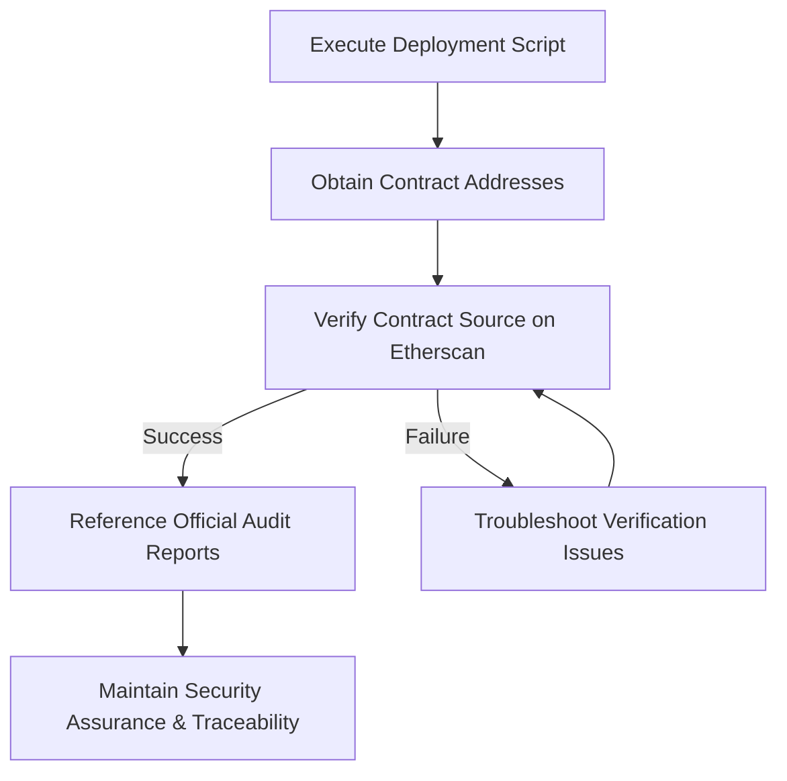

# Verifying and Auditing a Deployment

Ensuring the integrity and transparency of your Aave Vault deployment is crucial for maintaining trust, security, and regulatory compliance. This guide walks you through verifying your deployed contracts on public explorers like Etherscan, accessing official audit reports for compliance assurance, and adopting best practices to maintain traceability and security throughout the vault’s lifecycle.

---

## 1. Why Verify Your Deployment?

Verifying your deployed contracts publicly offers multiple benefits:

- **Transparency:** Allows users and integrators to inspect the exact source code running on-chain, enhancing confidence in vault operations.
- **Security Assurance:** Demonstrates adherence to audit-reviewed codebases, helping detect unauthorized modifications.
- **Compliance:** Supports internal and external regulatory and governance requirements by providing an auditable trail.
- **Debug & Support:** Facilitates troubleshooting through readable contract source code linked to your deployment.

<Tip>
Always verify your deployed contracts soon after deployment to avoid confusion, ease integration, and support future maintenance.
</Tip>

---

## 2. Verifying Contracts on Etherscan

Etherscan is the primary platform to verify and publish your smart contracts’ source code on supported networks such as Polygon Mainnet and Mumbai Testnet.

### Step-by-Step Verification Process

<Steps>
<Step title="Locate Your Contract Address">
Identify the deployed contract address from your deployment script output or transaction receipt.
</Step>
<Step title="Open Etherscan (or Polygonscan for Polygon)">
Navigate to the appropriate block explorer matching your deployed network:
- Polygon Mainnet: [https://polygonscan.com](https://polygonscan.com)
- Mumbai Testnet: [https://mumbai.polygonscan.com](https://mumbai.polygonscan.com)
</Step>
<Step title="Search for the Contract Address">
Paste the contract address into the search bar and open its details page.
</Step>
<Step title="Verify & Publish">
Click on the 'Contract' tab, then select "Verify and Publish". Follow the prompts:
- Select the correct compiler version (e.g. solc8.10).
- Select optimization settings as used during compilation.
- Paste your flattened contract source code or point to the correct project files if supported.
- Provide constructor arguments (hex-encoded), if applicable.
</Step>
<Step title="Submit and Confirm">
Submit the verification request. Upon successful verification, the contract source code and ABI will be available publicly.
</Step>
</Steps>

### Practical Tips
- Use exact compiler versions and settings from your deployment environment to avoid verification mismatches.
- Automate verification using Foundry or Hardhat plugins that support Etherscan verification within your deployment pipeline.
- Keep constructor arguments handy; tools like `cast` from Foundry can help encode them.

<Note>
Incorrect or incomplete contract verification can lead to confusion and reduce transparency, impacting trust with users and partners.
</Note>

---

## 3. Accessing and Utilizing Audit Reports

Audit reports provide an independent assessment of your vault’s security posture. They document identified risks, mitigations, and code quality.

### Where to Find Audit Reports

- The official [Aave Vault GitHub repository](https://github.com/aave/Aave-Vault) contains links to the latest audit reports.
- External audit firms’ websites or trusted DeFi security portals often publish reports relevant to Aave Vault.
- Documentation section **Security Audits & Support Channels** at: `/getting-started/troubleshooting-support/audits-and-support`

### How to Use Audit Reports

- **Pre-Deployment Review:** Understand potential risks before launching your vault.
- **Compliance Evidence:** Use reports for internal security reviews or regulatory compliance.
- **Ongoing Security Assessment:** Track any updates in audits after upgrades or patches.
- **Community Transparency:** Share audit findings with users and integrators to build credibility.

<Tip>
Always use the most recent audit report corresponding to the exact version of the deployed vault contracts to ensure accuracy.
</Tip>

---

## 4. Best Practices for Maintaining Security Assurance

Security does not end with a successful deployment and verification. Maintaining ongoing assurance requires proactive practices:

### Keep Detailed Deployment Records

- Document contract addresses, deployment transactions, and verification status.
- Record compiler versions and build parameters for each deployment.

### Monitor for Contract Changes

- Use Etherscan’s contract verification status as a baseline.
- Track any future upgrades and verify each updated contract promptly.

### Maintain Access to Source Code & Build Artifacts

- Preserve the exact source files and build outputs used in deployment.
- Use version control systems (e.g., Git) to track changes and support audits.

### Leverage On-Chain Monitoring Tools

- Utilize external monitoring services that alert on suspicious contract activity or interactions.

### Engage the Community

- Share verification and audit data openly.
- Encourage community scrutiny and bug reporting through formal channels.

<Warning>
Never skip source verification or delay publishing audit reports; doing so weakens security transparency and stakeholder trust.
</Warning>

---

## 5. Troubleshooting Verification Issues

Even experienced deployers encounter verification problems. Here are common issues and how to resolve them:

<AccordionGroup title="Common Verification Problems">
<Accordion title="Mismatch in Compiler Version or Optimization Settings">
Ensure the compiler version and optimization flags used to compile your contracts during deployment exactly match those supplied in the verification process.
</Accordion>
<Accordion title="Incorrect Constructor Arguments">
Double-check constructor input parameters and encode them correctly (usually as hex strings). Tools like Foundry’s `cast` can assist.
</Accordion>
<Accordion title="Multi-File or Flattened Sources Issues">
If your contract consists of multiple files, flattening them into a single source file may help. Verify with a tool compatible with your verification service.
</Accordion>
<Accordion title="Network or Explorer Mismatch">
Ensure you are verifying on the correct blockchain explorer matching your deployed network (e.g., Polygon Mainnet vs Mumbai Testnet).
</Accordion>
</AccordionGroup>

<Check>
If problems persist, review the deployment logs, rebuild with debug info, or consult the community and audit teams for assistance.
</Check>

---

## 6. Maintaining Traceability Post-Deployment

Traceability ensures you can map on-chain state and transactions back to source code and deployment metadata.

- Store deployed contract ABIs alongside source to interpret transactions.
- Keep version tagging consistent between deployed contracts and source repositories.
- Use changelogs or release notes to capture upgrades or parameter changes.
- Link deployments to monitoring dashboards and alerting triggers.

This traceability is essential for audit, compliance, and any incident response requiring forensic analysis.

---

## Additional Resources

- [Deploy.s.sol Script (GitHub)](https://github.com/aave/Aave-Vault/blob/main/script/Deploy.s.sol) — Primary deployment script used for Etherscan verification context.
- [Security Audits & Support Channels](/getting-started/troubleshooting-support/audits-and-support) — Details on audits and communicating with official support.
- [Running the Deployment Script](/deployment/deploying-the-vault/running-the-deployment-script) — Context on deployment and verification command usage.
- [Configuring Deployment Parameters](/deployment/deploying-the-vault/configuring-deployment-parameters) — Insight into parameters influencing verified deployments.

---

## Summary Diagram of the Verification Flow

Maintaining this continuous cycle ensures your deployment remains secure, trustworthy, and compliant throughout its operational lifecycle.

---

By following this guide, you empower your deployment process with trusted verification and auditing practices that safeguard user confidence and operational excellence in your Aave Vault deployment.