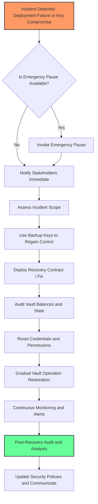

# Disaster Recovery Checklist

The Disaster Recovery Checklist is your essential guide to prepare for and recover from unexpected deployment failures or critical key compromises within the Aave Vault environment. This page equips you with a clear, prioritized list of tasks designed to help you re-establish vault operation swiftly, protect user funds, and maintain trust in your vault deployment.

---

## 1. Pre-Recovery Preparations: Establishing a Secure Baseline

Before a disaster occurs, ensuring readiness is paramount. These preemptive actions minimize downtime and losses.

### Key Tasks:
- **Maintain Secure Backups of Critical Keys and Credentials**
  - Store private keys and any mnemonic phrases offline in hardware wallets or secure physical locations.
  - Ensure multiple trusted stakeholders have emergency access to backups in secure, separate locations.

- **Document Access Control and Permissions**
  - Maintain up-to-date records of authorized addresses with permissions to manage the vault.
  - Regularly audit this list and remove outdated or unused access.

- **Enable Pausable Contracts or Emergency Mechanisms**
  - If implemented, familiarize yourself with emergency pause functions (`Pausable` contract patterns) to halt operations instantly when needed.

- **Routine Testing of Recovery Procedures**
  - Schedule and perform mock drills simulating a key compromise or deployment failure.
  - Verify backup integrity and restoration steps to ensure preparedness.

<Tip>
Pre-recovery diligence is your best defense. Proactive security and process validation reduce the risk of catastrophic losses and facilitate smooth recovery.
</Tip>

---

## 2. Immediate Actions After Deployment Failure or Key Compromise

Rapid, decisive action limits damage and starts the path to recovery.

### Step-by-Step Response:

<Steps>
<Step title="Assess the Scope of the Incident">
Identify the type of failure or compromise — whether it's loss of keys, contract malfunction, or suspected unauthorized access.
</Step>
<Step title="Pause Vault Operations (If Available)">
Invoke emergency pause or equivalent functions to prevent further deposits, withdrawals, or interactions to safeguard assets.
</Step>
<Step title="Notify Key Stakeholders and Users">
Communicate transparently with stakeholders and affected users regarding the incident and mitigation plans.
</Step>
<Step title="Initiate Backup Key Protocols">
Use secure backups of private keys or multisig arrangements to regain control over the vault.
Confirm authenticity carefully to avoid further compromises.
</Step>
<Step title="Engage Incident Response Team">
Mobilize your security and operational teams immediately to address the issue.
</Step>
</Steps>

<Warning>
Avoid hasty reaction that bypasses verification steps. Acting on unverified backups or compromised channels may worsen the situation.
</Warning>

---

## 3. Re-Establishing Vault Control and User Funds Protection

Once control is regained, the priority is to restore vault functionality securely and safeguard user assets.

### Essential Recovery Measures:
- **Deploy or Upgrade to a Restored/Fix Contract Version**
  - Use tested upgrade or deployment scripts to replace compromised contracts.
  - Verify deployments via test suites and audits before final activation.

- **Reset or Rotate Access Credentials and Keys**
  - Issue new private keys, update multisig configurations, and revoke compromised credentials.

- **Audit Vault State and Balances Thoroughly**
  - Confirm the integrity of the vault's asset holdings and share accounting.
  - Cross-check on-chain balances versus off-chain records.

- **Resume Operations with Limited Permissions Initially**
  - Gradually restore vault functionality, starting with read-only or monitored modes if possible.

- **Monitor Transactions and Events Closely**
  - Implement real-time alerting for suspicious activity.

<Info>
Restoration is a carefully staged process. Prioritize integrity and transparency to maintain user trust.
</Info>

---

## 4. Post-Recovery Procedures

After core recovery, focus on closing gaps and preventing recurrence.

- **Conduct a Security Post-Mortem and Root Cause Analysis**
  - Identify vulnerabilities exploited or operational weaknesses.

- **Update Security Policies and Emergency Protocols**
  - Incorporate lessons learned into revised playbooks and training.

- **Communicate with Users Continuously**
  - Provide updates on recovery status, compensations if any, and future safeguards.

- **Schedule Additional Audits and Penetration Tests**
  - Validate improvements and bolster defenses.

- **Review and Update Backup and Key Management Practices**
  - Reinforce backup security and access controls.

---

## 5. Practical Tips for Disaster Recovery Success

- Regularly validate backups and access recovery channels for integrity and availability.
- Use multisig wallets for critical key operations to reduce single-point failures.
- Document every action taken during recovery for audit trails.
- Keep deployment and upgrade scripts up-to-date and tested.
- Integrate monitoring tools from day one to detect anomalies early.

## 6. Common Pitfalls to Avoid

- Delaying response due to unclear roles or lack of procedure.
- Using unverified or incomplete backups for recovery.
- Overlooking the need to revoke compromised credentials.
- Neglecting communication, causing confusion or mistrust among users.

---

## Additional Resources

- [Security Hardening Guide](../security-hardening)
- [Upgrade and Rollback Strategies](../upgrade-and-rollback-strategies)
- [Deployment Prerequisites](../deployment-prerequisites)
- [Troubleshooting Common Setup Issues](../../getting-started/troubleshooting-support/troubleshooting-common-issues)

---

## Summary Diagram: Disaster Recovery Workflow

---