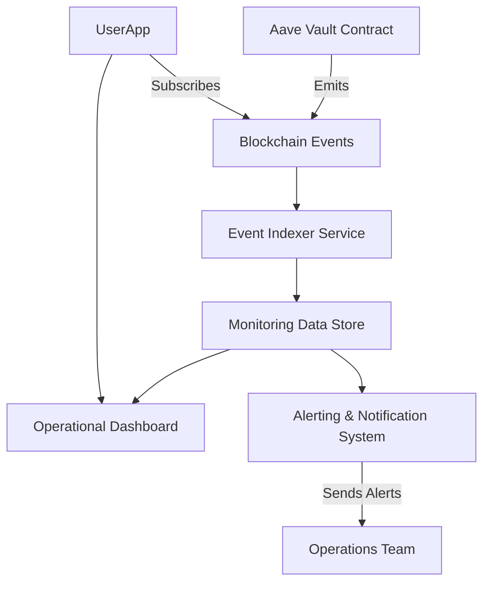

# Monitoring and Logging

Effective monitoring and logging are critical for maintaining the health, transparency, and reliability of your Aave Vault deployment. This page guides you through the best practices and solutions for tracking contract events, understanding transaction status, and ensuring operational awareness both on-chain and off-chain.

---

## Understanding Monitoring Objectives

Monitoring within the Aave Vault ecosystem serves several vital purposes:

- **Contract Event Tracking**: Accurately capture and interpret on-chain events emitted by the vault and related contracts.
- **Transaction Status Awareness**: Determine the success or failure of contract interactions to maintain system integrity.
- **Operational Health Checks**: Stay alerted to anomalies, gas usage issues, or unexpected state changes that might indicate problems.
- **User Visibility**: Provide clear feedback to end-users and integrators regarding vault activities.

With these objectives, monitoring supports both operational excellence and user trust.


## 1. On-Chain Event Tracking

The Aave Vault smart contract emits critical events corresponding to key actions such as deposits, withdrawals, yield accrual, and fee collection. Tracking these events allows you to maintain an accurate, real-time picture of usage and system status.

### Key Event Categories

- **Deposit and Withdrawal Events**: Capture user initiation and completion, including all supported modes (direct deposit, aToken deposit, meta-transactions).
- **Yield and Fee Events**: Monitor yield accrual triggers (`accrueYield`) and fee collection events to reconcile revenue streams.
- **Meta-Transaction Executions**: Track signature-based meta-transactions that enable gasless interactions.

### Practical Tips

- Use a blockchain event indexer for reliable, timely event capture.
- Filter events by relevant vault contract addresses.
- Correlate event logs with user addresses for insightful analytics.

### Example: Listening for Deposit Events

```javascript
const depositEventFilter = vaultContract.filters.Deposit();
vaultContract.on(depositEventFilter, (owner, assets, shares, event) => {
  console.log(`Deposit detected: Owner=${owner}, Assets=${assets}, Shares=${shares}`);
  // Additional processing or alerts
});
```


## 2. Transaction Status Monitoring

Since blockchain transactions may succeed or fail due to various conditions (gas exhaustion, revert statements, or external conditions), it’s crucial to verify transaction outcomes.

### Approaches

- **Receipt Inspection**: After transaction submission, poll the transaction receipt to check the `status` field (1 indicates success, 0 failure).
- **Error Logs Analysis**: Use provider RPC tools or explorer APIs to identify revert reasons.

### Best Practice
Always implement error-handling and retries where appropriate, especially for critical deposit or withdraw operations.


## 3. Operational Health and Alerting

Beyond direct contract events, maintaining overall operational health involves monitoring deeper metrics and alert conditions.

### Metrics to Track

- **Vault Balance and Supply Metrics**: Track `totalSupply()`, `getLastVaultBalance()`, and fee accrual values regularly.
- **Gas Usage**: Unexpected spikes during transactions can signal inefficiencies or attacks.
- **Yield Accrual Calls**: Ensure periodic triggering of yield accrual function without failures.

### Alerts and Notifications

Set up off-chain alerting systems integrating with contract data to notify maintainers:

- When a transaction fails unexpectedly.
- If fees or accrued yields deviate from expected patterns.
- When gas usage exceeds predefined thresholds.

### Integration Hooks
Utilize the contract’s exposed methods and events in conjunction with external services (e.g., TheGraph, Alchemy, Infura) to integrate monitoring data into dashboards and alert platforms.


## 4. Combining On-Chain and Off-Chain Monitoring

To maximize visibility:

- **On-chain**: Listen to all emitted events and query contract states for real-time data.
- **Off-chain**: Aggregate event data, analyze trends, and push alerts through communication channels (email, Slack, PagerDuty).


## 5. Troubleshooting Common Monitoring Issues

### Delayed or Missing Events
- Ensure your node or provider supports full historical logs.
- Check network or RPC endpoint health.

### Transaction Status Unclear
- Verify you are awaiting transaction confirmation before checking status.
- Check for nonce gaps or transaction replacements.

### Alert Fatigue
- Tune alert thresholds to minimize noise.
- Aggregate similar alerts into digest forms.


## 6. Useful References and Resources

- **Contract Methods for Monitoring**: Use public `getLastVaultBalance()`, `getAccumulatedFees()`, and balance-related view methods to validate vault state.
- **Event Documentation**: Refer to the vault’s ABI and event definitions for exact signatures.
- **Integration Touchpoints**: See the [Ecosystem Integration](https://yourdocs.link/overview/architecture-feature-overview/integration-touchpoints) page for advanced monitoring integrations.

---

### Related Documentation

- [Deploying Aave Vault](https://yourdocs.link/getting-started/configure-run-validate/deploying-vault) – Guide for deployment setup
- [First Run & Quick Validation](https://yourdocs.link/getting-started/configure-run-validate/first-run-quick-validation) – Tips for confirming correct deployment
- [Upgrade and Rollback Strategies](https://yourdocs.link/deployment/operational-excellence/upgrade-and-rollback-strategies) – Maintaining stable operation
- [Security Hardening](https://yourdocs.link/deployment/operational-excellence/security-hardening) – Secure monitoring practices


---

For comprehensive monitoring, integrate on-chain event tracking with robust off-chain alerting and dashboarding. This ensures users and maintainers alike sustain full confidence in the health and operations of the Aave Vault deployment.


---

## Appendix: Example Monitoring Architecture Diagram




---

# Monitoring Checklist

- [x] Subscribe to deposits, withdrawals, yield, and fee events
- [x] Monitor transaction confirmation status and revert reasons
- [x] Periodically check vault balances and accrued fees
- [x] Set up thresholds for unusual activity or gas usages
- [x] Integrate off-chain alerting for critical issues
- [x] Test alert workflows and incident responses


---

For code-level users, explore the contract events and public view methods in the repository [Aave Vault GitHub - Deploy.s.sol](https://github.com/aave/Aave-Vault/blob/main/script/Deploy.s.sol) and the related specs files to see precise contracts interaction points valuable for monitoring.


---

If you encounter challenges or require advanced solutions, consult the [Security Audits & Support Channels](https://yourdocs.link/getting-started/troubleshooting-support/audits-and-support) page or join the community forums for assistance.


---