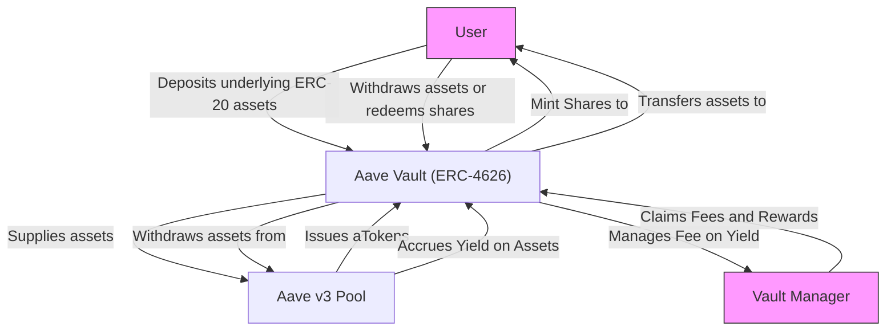

# What is Aave Vault?

Aave Vault is a robust, audited smart contract designed to simplify how users deposit and withdraw supported ERC-20 tokens while maximizing yield generation through seamless integration with Aave v3. It acts as a tokenized vault adhering to the ERC-4626 standard, allowing for efficient asset management with a built-in fee-on-yield mechanism that enables vault managers to earn fees from the yield generated.

This page introduces the product’s core purpose, identifies the primary audiences, and outlines a typical user journey to help you understand how Aave Vault adds value and fits into your DeFi strategies or development workflows.

---

## Core Value Proposition

At its heart, Aave Vault empowers users to passively earn yield on their ERC-20 assets by leveraging Aave v3's market-leading liquidity and interest accrual mechanisms. Unlike directly interacting with Aave, this vault:

- Abstracts complex deposit and withdrawal flows into a simple interface.
- Automatically handles asset supply and withdrawal to Aave on behalf of users.
- Implements the ERC-4626 standard, enabling compatibility with other DeFi composable protocols.
- Incorporates a fee-on-yield feature where vault managers can claim fees on the yield earned, aligning incentives and enabling sustainable vault management.

By automating these processes, Aave Vault streamlines user experience, reduces operational friction, and enables institutions, integrators, and strategists to focus on yield optimization rather than infrastructure complexities.

---

## Who Should Use Aave Vault?

Aave Vault is built for several key audiences within the decentralized finance ecosystem:

### 1. DeFi Developers and Protocol Integrators

- Quickly incorporate robust yield vaults compliant with ERC-4626.
- Integrate sophisticated deposit/withdraw mechanisms backed by Aave v3 liquidity.
- Leverage meta-transaction features to enable gasless interactions and third-party transaction signing.

### 2. Yield Strategists and Vault Managers

- Manage vault strategies efficiently with control over fees on yield.
- Benefit from automated yield accrual while maintaining transparency and security.
- Rescue tokens or claim rewards in exceptional cases through administrative functions.

### 3. Security Auditors and Protocol Analysts

- Examine a thoroughly audited, transparent implementation integrating Aave’s core components.
- Understand interaction flows between vault shares, aTokens, and the underlying Aave Pool.
- Evaluate the fee accounting and yield accrual in compliance with best security practices.

---

## Typical User Journey

Imagine you are a yield-seeking DeFi user or an application developer aiming to provide users with passive income generation on their stablecoins or tokens supported by Aave v3. Your interaction with Aave Vault flows as follows:

### 1. Deposit Assets

You deposit an accepted ERC-20 token (e.g., DAI) into the vault. Aave Vault supplies your assets to Aave v3 under the hood, and you receive vault shares (ERC-4626 tokens) representing your stake.

### 2. Earn Yield Automatically

The vault accrues yield by continuously interacting with Aave's lending pool, increasing your underlying value. The vault manager takes a predefined fee on this yield, accruing fees transparently.

### 3. Withdraw or Redeem

When you want your tokens back, you can withdraw or redeem shares directly from the vault. The vault handles withdrawal from Aave and transfers the appropriate amount of underlying tokens back to you, net of any fees.

### 4. Optional Advanced Interactions

Developers can use meta-transaction methods to facilitate gasless transactions or signed calls on behalf of users. Vault managers can claim additional reward tokens earned or rescue mistakenly sent tokens.

---

## Key Features Highlight

- **ERC-4626 Compliance:** Compatible with the standard interface for tokenized vaults, facilitating composability.
- **Automated Aave Supply/Withdrawal:** Behind-the-scenes interaction with Aave’s Pool for yield generation.
- **Fee-on-Yield Mechanism:** Managers can set, update, and withdraw fees on yield earned.
- **Signature-Based Actions:** Supports EIP-712 based meta-transactions for deposit, mint, withdraw, and redeem operations.
- **Reward Claims & Emergency Rescue:** Vault managers have dedicated functionality for claiming Aave rewards and rescuing tokens.
- **Secure Ownership Control:** Access control ensures only owners/authorized managers can change fees or perform administrative tasks.

---

## Where to Go Next

To start using or integrating the Aave Vault, we recommend the following documentation pages:

- [Core Concepts & Terminology](../../overview/product-intro/core-concepts-terminology) – Understand the foundational technologies, terms, and flows.
- [Feature Overview](../../overview/architecture-feature-overview/feature-overview) – Dive deeper into the vault’s rich capabilities and design.
- [Deploying Aave Vault](../../getting-started/configure-run-validate/deploying-vault) – Step-by-step deployment and configuration instructions.
- [First Run & Quick Validation](../../getting-started/configure-run-validate/first-run-quick-validation) – Learn how to test and validate your deployment.
- [Troubleshooting Common Setup Issues](../../getting-started/troubleshooting-support/troubleshooting-common-issues) – Solutions for common bumps during setup.

---

## Additional Resources

- **Audit Reports:** The vault has been audited by OpenZeppelin, PeckShield, and formally verified by Certora. Explore the [audits folder](./audits) for detailed reports.
- **Source Code:** Explore the complete vault implementation in the [GitHub repository](https://github.com/aave/Aave-Vault).
- **Community & Support:** For help, join Aave’s community forums and developer channels linked in the documentation.

---

<Info>
Aave Vault’s design ensures a secure, transparent, and user-friendly yield experience leveraging Aave v3 liquidity while maintaining compatibility with the growing DeFi ecosystem.
</Info>

---

## Diagram: High-Level Interaction Flow

---

## Tips for Users and Developers

- Always verify the supported ERC-20 assets on Aave v3 before interacting with the vault.
- When deploying, ensure your referral codes and pool address providers are accurate.
- Use meta-transactions carefully to enable gasless operations, but always validate signatures.
- Monitor accrued fees and manage timely fee withdrawals to maintain vault health.
- In emergencies, use the rescue functionality cautiously to avoid asset loss.

---

## Frequently Asked Questions

<AccordionGroup title="FAQs">
<Accordion title="What assets can I deposit into Aave Vault?">
You can deposit any ERC-20 token supported by Aave v3, as the vault directly supplies these assets to the Aave lending pool. Always check the supported assets list on the official Aave documentation.
</Accordion>
<Accordion title="How does the fee on yield work?">
Vault managers set a fee ratio applied only on the yield earned from supplying assets to Aave. This fee is accumulated in the vault and can be withdrawn by the manager. Initial deposits and principal are unaffected.
</Accordion>
<Accordion title="Can I deposit aTokens directly?">
Yes. The vault supports deposit, mint, withdraw, and redeem operations with underlying tokens or aTokens, providing flexibility depending on user preferences.
</Accordion>
<Accordion title="How do meta-transactions work with Aave Vault?">
The vault enables signature-based deposit, mint, withdraw, and redeem calls compliant with EIP-712, allowing third parties to submit transactions on behalf of users who provide prior signatures.
</Accordion>
<Accordion title="Is the vault audited?">
Yes. The vault has undergone multiple audits from reputable firms including OpenZeppelin and PeckShield and has been formally verified by Certora.
</Accordion>
</AccordionGroup>
