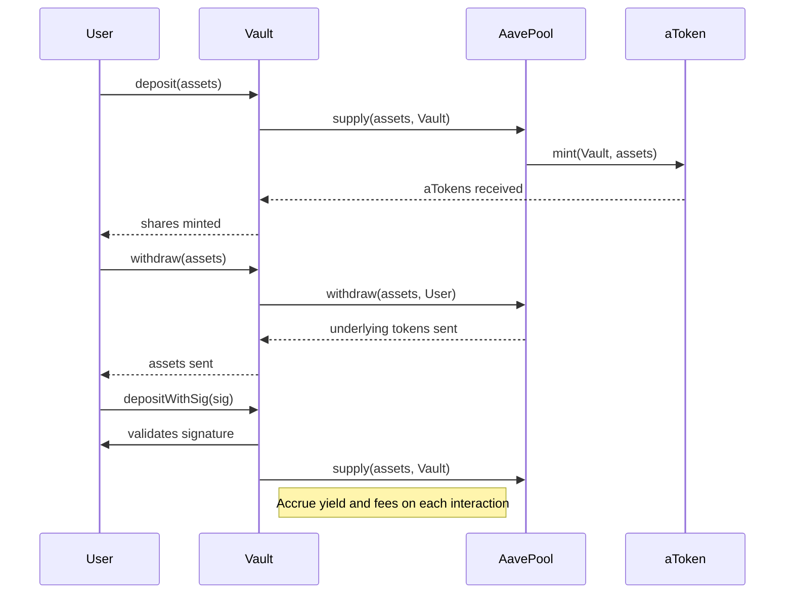

# Feature Overview

Discover the full capabilities of the Aave Vault, an ERC-4626 compliant vault designed for seamless integration with Aave v3. This page provides an actionable snapshot of the vault's supported features, mapped directly to user workflows and the value they unlock for your asset management and yield optimization strategies.

---

## ERC-4626 Compliance: Tokenized Vault Standard

At its core, the Aave Vault adheres strictly to the [ERC-4626](https://eips.ethereum.org/EIPS/eip-4626) standard, bringing all the benefits of a widely adopted tokenized vault interface:

- **Standardized deposit, mint, withdraw, and redeem flows**: Users can manage their underlying assets and vault shares with familiar, intuitive calls.
- **Share-based accounting**: Vault shares represent a user’s proportional claim on the underlying assets, allowing smooth handling of yield accrual and fee assessments.
- **Compatibility**: Integrates easily into wallets, DeFi aggregators, and tooling built around ERC-4626.

This standardization ensures predictable behavior and composability, so whether you’re a yield seeker, developer, or protocol strategist, interacting with the vault is straightforward.

## Deposit & Withdraw Workflows

The vault supports multiple user-centric asset management workflows:

- **Depositing Assets**: Users supply supported ERC-20 tokens to the vault.
- **Minting Shares**: Directly mint vault shares by specifying the desired amount.
- **Withdrawing Assets**: Redeem underlying tokens by burning a proportional amount of shares.
- **Redeeming Shares**: Convert vault shares back to underlying assets.

Connection to Aave v3 underpins these flows by managing asset supply and withdrawal on the protocol, ensuring users earn yield on their deposits seamlessly.

### Deposit Variants

- **Deposit underlying tokens**: Assets are deposited and supplied into Aave automatically.
- **Deposit aTokens directly**: Users can deposit Aave's interest-bearing tokens (aTokens) into the vault.
- **Deposit with Signature (`depositWithSig` and `depositATokensWithSig`)**: Meta-transaction style deposits enable third-party smart contracts or relayers to deposit on the user’s behalf securely via EIP-712 signatures.

### Withdraw Variants

- **Withdraw underlying tokens**: Burns shares to withdraw ERC-20 tokens from Aave.
- **Withdraw aTokens directly**: Withdraw interest-bearing tokens.
- **Withdraw with Signature (`withdrawWithSig` and `withdrawATokensWithSig`)**: Allows authorized third-party execution using signed permissions.

This flexible design supports diverse user needs, including delegated asset management and integration with dApps or wallets.

## Yield Accrual and Fee Mechanism

The vault tracks the growth in aToken balances to monitor yield earned from Aave v3. It levies a configurable **fee on the yield**, automatically accruing fees without interrupting user balances or liquidity:

- **Real-time yield accrual**: Fees are calculated whenever vault state changes (e.g., deposits, withdrawals).
- **Configurable fee ratio**: The vault owner sets the fee rate, expressed as a wad (e.g., `1e18` for 100%).
- **Claiming fees**: Owner can withdraw accrued fees as aTokens.

This model ensures fair, transparent fee collection tied directly to yield generated.

## Meta-Transaction Support

The vault supports EIP-712 typed data signatures, enabling meta-transactions for deposit, mint, withdraw, and redeem actions. This unlocks key user and developer benefits:

- **Gasless interactions**: A trusted relayer or dApp can initiate transactions on behalf of users spending only their own ETH.
- **Improved UX**: Users can delegate asset management without forfeiting control.
- **Security & Compliance**: The meta-transaction flows include thorough signature validation, nonce tracking, and deadline enforcement to prevent replay or misuse.

Meta-tx support is a critical layer for dApps integrating Aave Vault, especially mobile wallets, aggregator platforms, and gas optimization solutions.

## Multi-Network Support

Out-of-the-box, the vault supports deployment and operation on multiple chains, notably Polygon and Avalanche. Network support includes:

- **RPC connectivity configuration**: Forking and testing harness include Polygon and Avalanche RPC URLs to simulate and validate vault behavior.
- **Deployment scripts manage network targeting** with verification and broadcasting on testnets and mainnets.
- **Fee and rewards mechanisms integrate with Aave’s incentives across networks.**

This cross-chain flexibility empowers strategic yield optimization across ecosystems.

## Integration Points with Aave v3

The vault tightly integrates with Aave v3’s protocol components:

- **Pool Addresses Provider**: Dynamically retrieves Aave pool and reserve data.
- **Aave Pool**: Supplies and withdraws underlying assets to/from Aave.
- **aTokens**: Accepts deposits and manages withdrawals as interest-bearing tokens.
- **Yield rewards controller**: Enables claiming of additional rewards on vault deposits.

Together, these integrations assure up-to-date reserve status, cap constraints, and protocol compliance, while exposing familiar interfaces matching Aave's robust ecosystem.

## User Workflow Illustration



## Practical Tips and Best Practices

- Always provide sufficient initial lock deposit when initializing the vault to prevent rounding issues.
- Use EIP-712 meta-transactions for improved UX in gas-sensitive environments.
- Monitor `maxDeposit`, `maxWithdraw`, `maxMint`, and `maxRedeem` functions to handle Aave protocol limits.
- Vault managers should periodically claim fees and rewards to ensure accrual balances.
- Emergency rescue is available for tokens accidentally sent to the vault (except aTokens).

## Common Pitfalls & Troubleshooting

- Deposits exceeding protocol caps will be rejected; always check `maxDeposit`.
- Signature-based methods require correct nonce and deadline values; expired or replayed signatures cause reverts.
- Attempting to rescue aTokens will revert to protect underlying assets.
- Only the vault owner can update fee rates or withdraw accrued fees.

For detailed error codes, execution traces, and tests, refer to the [testing suite](test/ATokenVaultWithSig.t.sol) and [forked integration tests](test/ATokenVaultFork.t.sol).

## Next Steps

Explore the following documentation to deepen your understanding and complete your integration:

- [What Is Aave Vault?](what-is-aave-vault) — foundational concepts and product vision
- [Core Concepts & Terminology](core-concepts-terminology) — key definitions and mechanisms
- [Target Audience & Use Cases](target-audience-use-cases) — practical usage scenarios
- [Deploying Aave Vault](deployment/deploying-the-vault/setting-up-deployment) — deployment prerequisites and scripts


---

## References

- [ERC-4626 Standard](https://eips.ethereum.org/EIPS/eip-4626)
- [Aave v3 Protocol](https://docs.aave.com/developers/protocol-v3)
- [Aave Vault GitHub Repository](https://github.com/aave/Aave-Vault)

---

## Source Code Snippet: Deposit With Signature

```solidity
function depositWithSig(
    uint256 assets,
    address receiver,
    address depositor,
    EIP712Signature calldata sig
) public returns (uint256) {
    MetaTxHelpers._validateRecoveredAddress(
        MetaTxHelpers._calculateDigest(
            keccak256(
                abi.encode(
                    DEPOSIT_WITH_SIG_TYPEHASH,
                    assets,
                    receiver,
                    depositor,
                    _sigNonces[depositor]++,
                    sig.deadline
                )
            ),
            _domainSeparatorV4()
        ),
        depositor,
        sig
    );
    return _handleDeposit(assets, receiver, depositor, false);
}
```

This shows the meta-transaction flow verification, enabling third-party calls on behalf of users authorized by signature.

---