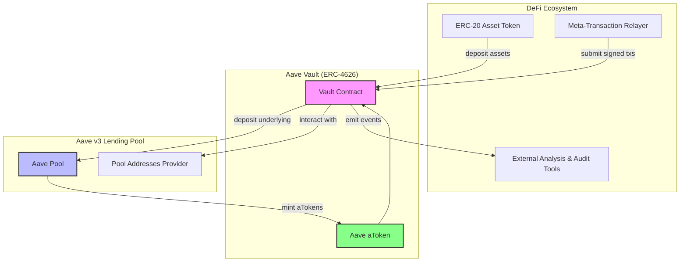

# Ecosystem Integration

Explore how the Aave Vault seamlessly integrates with the broader DeFi landscape, featuring robust connections to Aave v3 lending pools, support for widely adopted ERC-20 assets, and compatibility with meta-transactions and external tooling. This foundational page lays the groundwork to understand the vault's role within the DeFi ecosystem and unlock deeper technical integration insights in upcoming documentation.

---

## Why Ecosystem Integration Matters

Imagine building a financial tool that effortlessly taps into existing decentralized finance infrastructure — no need to reinvent the wheel, just plug in and scale. That’s precisely what Aave Vault achieves by integrating tightly with Aave v3, handling a broad spectrum of ERC-20 tokens, and supporting meta-transactions to enhance user experience.

Through this page, you'll discover how these integration points empower you to build more efficient, secure, and composable DeFi applications.

---

## What You Will Learn Here

- How Aave Vault interfaces with **Aave v3 lending pools**, virtually becoming an extension of your yield engine.
- The support and requirements around **ERC-20 assets** that the vault handles.
- The vault’s **compatibility with meta-transactions**, enabling gasless and delegated operations.
- How to integrate external **analysis and audit tooling** to monitor and secure your vault deployments.

---

## Integration with Aave v3 Lending Pools

The Aave Vault operates as a specialized ERC-4626 vault that directly connects with Aave v3's lending pools. This tight coupling ensures your deposited assets are efficiently deployed into Aave’s liquidity pools to start generating yield immediately.

**Key Points:**

- The vault retrieves the pool address dynamically through the Aave Pool Addresses Provider, enabling multi-network and version adaptability.
- Deposited tokens are wrapped as Aave aTokens inside the vault, giving users transparent access to their accrued interest.
- All vault interactions (deposits, withdrawals, rewards claims) propagate through the Aave Pool contract to maintain consistent state and security.

This design allows your vault to benefit from the reliability, liquidity, and incentive structures native to Aave v3, ensuring your assets are never idle.

---

## Robust Support for ERC-20 Assets

Aave Vault exclusively supports assets compliant with the ERC-20 token standard — the established norm in Ethereum and many EVM-compatible chains.

**Why this matters:**

- You can deposit any ERC-20 token supported by Aave v3, opening access to a broad universe of assets.
- The underlying asset's contract address is explicitly referenced in the vault, ensuring accurate accounting and transfers.
- The vault interacts directly with tokens to handle deposits, withdrawals, and balance tracking, abstracting the complexity from end users.

This compatibility enables vault consumers — whether wallet users, dApps, or integration partners — to work with standardized digital assets seamlessly.

---

## Meta-Transaction Compatibility: Unlocking Gasless UX

To improve accessibility and reduce friction, Aave Vault supports meta-transactions. This lets users delegate and authorize vault operations (like deposits or withdrawals) via EIP-712 typed data signatures.

**How it works:**

- A user signs a typed message authorizing a vault operation off-chain.
- A relayer submits the operation on-chain, paying gas on the user’s behalf.
- The vault verifies these signed instructions securely before executing the requested transaction.

**Benefits to you as a developer or integrator:**

- Enable gasless interactions improving onboarding and user satisfaction.
- Support third-party services to perform operations on behalf of users, such as automated yield strategies or custodial wallets.
- Future-proof your integration to work with evolving Ethereum standards around delegation and account abstraction.

---

## Compatibility with External Analysis and Audit Tooling

Security and transparency are paramount in DeFi. The vault’s design anticipates integration with external tooling for:

- **Real-time monitoring:** Track vault balances, fee accruals, and reward claims through on-chain data feeds.
- **Auditing and compliance:** Automated verification of vault state transitions can be performed using external verifiers that rely on the vault's standardized interface.
- **Analytics:** Yield performance and user behavior insights can be extracted through standard token and event hooks emitted by the vault.

By following well-known standards like ERC-4626 and event-based notifications, the Aave Vault provides a clear and interoperable data surface for audit and analytics teams.

---

## Visualizing the Ecosystem Integration

This diagram highlights key relationships: deposits flow from ERC-20 assets through the vault into Aave pools; aTokens represent yield claims; meta-transactions enable gasless interactions; and external tools ingest emitted events for monitoring.

---

## Practical Usage Examples

- **dApp Integrators:** Build yield aggregation strategies by interacting with the vault’s standard ERC-4626 interface, while safely relying on Aave v3’s credit delegation and liquidity.

- **Wallet Providers:** Support streamlined gasless deposits using meta-transactions, allowing users to earn yield passively without managing gas complexity.

- **Auditors and Analysts:** Use the emitted events and standardized methods to verify fee calculations, yield accrual, and emergency operations transparently.

---

## Tips and Best Practices

- Always verify the vault's `AAVE_POOL` and `UNDERLYING` addresses at deployment to confirm supported assets and correct integration points.

- Leverage meta-transaction support to enhance user onboarding—but ensure that relayers are trusted or use decentralized relayer networks.

- Use external tooling to monitor vault health proactively, including fee accumulation and reward claiming to optimize returns.

- Consult the **Core Concepts & Terminology** page to deepen your understanding of ERC-4626 vault mechanics and yield behavior.

---

## Troubleshooting Common Integration Scenarios

<AccordionGroup title="Troubleshooting Ecosystem Integration">
<Accordion title="Why is my deposit not showing as accrued yield?">
Yield accrual is based on the interaction between the vault and the Aave Pool. If deposits appear delayed in yield reporting, ensure that the vault's scheduled updates or calls that trigger yield accrual are executed.
</Accordion>
<Accordion title="Can I deposit tokens unsupported by Aave v3?">
No. The vault only supports ERC-20 tokens registered with and accepted by Aave v3 lending pools. Depositing unsupported tokens will result in transaction failure.
</Accordion>
<Accordion title="How do meta-transactions impact fee calculation?">
Meta-transactions do not affect fee calculations directly but ensure that signed authorization is correctly verified before execution to prevent mismatch in state or fees.
</Accordion>
</AccordionGroup>

---

## Next Steps

After mastering ecosystem integration concepts, proceed to the following:

- [System Architecture](/overview/architecture-feature-overview/architecture-diagram) — Understand internal and external component interactions.
- [Feature Overview](/overview/architecture-feature-overview/feature-overview) — Dive into key capabilities related to deposits, withdrawals, fees, and meta-transactions.
- [Getting Started Guide](/getting-started/setup-intro/about-aave-vault) — Begin practical setup and deployment.

---

## References

- [ERC-4626 Tokenized Vault Standard](https://eips.ethereum.org/EIPS/eip-4626)
- [Aave v3 Protocol Documentation](https://docs.aave.com/developers/)
- [Meta-Transactions and EIP-712 Specification](https://eips.ethereum.org/EIPS/eip-712)

---