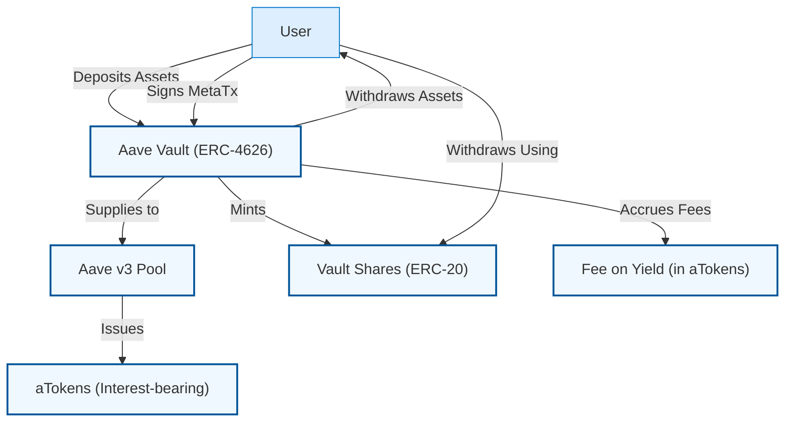

# Core Concepts & Terminology

Welcome to the foundational guide that demystifies the essential terms and concepts powering the Aave Vault. This page equips you with a strong mental model to understand how the vault operates, so you can confidently navigate deposits, withdrawals, yield accrual, and advanced features like meta-transactions.

---

## What You Will Learn Here

- **ERC-4626 Vault**: The standard tokenized vault model that Aave Vault implements
- **Aave v3 Integration**: How the vault interacts with Aave’s lending protocol
- **Deposit & Withdraw Flows**: The core user actions and their effects
- **Vault Shares**: What shares represent and how they relate to assets
- **Yield Fee Mechanism**: How fees on yield are calculated and collected
- **Meta-Transactions**: Enabling gasless and delegated vault operations

These concepts contextualize everything else you’ll see in the docs and product, unlocking clear understanding of vault behavior and user value.

---

## ERC-4626 Vault Explained

**ERC-4626** is an open Ethereum standard defining a common interface for tokenized vaults. It enables seamless interaction with vaults that accept deposits of tokens and mint redeemable shares representing pooled assets.

> **Why it matters:**
> - Standardized methods make integrations predictable and interoperable
> - Vault shares reflect your stake in pooled assets and any generated yield
> - Vaults manage underlying deposits, yield accrual, and withdrawals on your behalf

**Aave Vault is an ERC-4626 compliant vault** that wraps assets deposited into Aave v3 lending pools, amplifying yield opportunities in a standardized tokenized form.

---

## Aave v3: The Yield Engine

Aave Vault leverages **Aave v3**, a decentralized lending protocol, as the backend for earning yield. When you deposit assets into the vault, your tokens are supplied to Aave’s protocol,
where they earn interest alongside the broader liquidity pool.

- **AToken Representation:** Your deposited assets convert into Aave’s interest-bearing `aTokens` internally.
- **Dynamic Balance:** The vault’s underlying balance grows as interest accrues in Aave.

This integration allows users to enjoy passive yield without managing direct Aave interactions.

---

## Deposit and Withdrawal Flows

Understanding these flows is key to using the vault effectively:

| Action        | Description                                                     | Tokens Involved                   | Outcome                   |
|---------------|-----------------------------------------------------------------|---------------------------------|---------------------------|
| Deposit       | Lock underlying ERC-20 tokens into the vault.                   | Underlying token (e.g., DAI)     | Vault shares minted to user|
| Deposit ATokens| Deposit Aave's interest-bearing tokens directly.                | aTokens                         | Vault shares minted        |
| Withdraw      | Redeem vault shares for underlying tokens, withdrawing them.    | Vault shares redeemed             | Underlying tokens returned|
| Withdraw ATokens| Redeem vault shares for aTokens, if preferred.                   | Vault shares redeemed             | aTokens transferred        |

Vault shares serve as your encoded claim to the pooled assets, which appreciate as yield accrues.

---

## Vault Shares: Your Ownership Tokens

When you deposit assets into Aave Vault, you receive **vault shares**, representing your proportional ownership in the pooled assets managed by the vault.

- Shares continuously reflect your claim on the growing vault balance including yield.
- The **exchange rate** between shares and assets can change over time due to accrued yield minus fees.
- Shares can be deposited, transferred, and redeemed, just like ERC-20 tokens.

This tokenized ownership allows efficient accounting, transferability, and secondary market possibilities.

---

## Yield Fee Mechanism

Aave Vault includes a unique **fee-on-yield** feature: the vault charges a configurable fee measured as a percentage of the yield earned.

- Yield is calculated as the difference in vault balance (in aTokens) since the last accrual.
- A portion of this yield, defined by the vault fee, is set aside as **accumulated fees**.
- Fees are accrued internally and can later be withdrawn by the vault manager in the form of aTokens.

This fee model aligns incentives by charging fees only on actual yield generated, preserving principal amount.

---

## Meta-Transactions: Gasless and Delegated Operations

To improve usability, the vault supports **meta-transactions**, enabling third parties or delegated callers to initiate transactions on behalf of users.

- Users sign off-chain messages (EIP-712 signatures) authorizing actions.
- The vault verifies these signatures and executes deposit, mint, withdraw, or redeem operations accordingly.
- This allows gasless interactions or integration with relayers and smart contract wallets.

By abstracting signer gas payment, meta-transactions increase accessibility and flexibility.

---

## Summary Diagram: How Key Concepts Connect

---

## Practical Tips & Best Practices

- Ensure your wallet supports and approves sufficient allowance for underlying tokens before deposit.
- Use `deposit` or `depositWithSig` to fund vault with underlying assets.
- To deposit existing aTokens directly, use the corresponding `depositATokens` methods.
- Track your vault shares to understand your ownership proportion.
- Monitor `getClaimableFees` to understand fees pending withdrawal by the vault manager.
- Vault owner controls fee rate via `setFee`—keep updated on fee levels.
- Utilize meta-transactions for seamless, gasless user experiences if integrated with supported relayers.

---

## Common Pitfalls

- Depositing without sufficient approval will fail.
- Attempting to withdraw or redeem more than your vault shares or allowed maximum triggers errors.
- Vault owner-only functions like fee withdrawal and emergency rescue require owner permissions.
- Meta-transaction signatures must be valid and not expired.

---

## Next Steps: Apply These Concepts

Now that you’ve mastered the core terminology:

- Move on to the [Feature Overview](/overview/architecture-feature-overview/feature-overview) page to see these concepts in action
- Explore [Deploying Aave Vault](/deployment/deploying-the-vault/deploying-vault) for hands-on deployment
- Check the [What is Aave Vault?](/overview/product-intro/what-is-aave-vault) page for product introduction

By understanding these terms, you can now confidently operate, integrate, or develop with Aave Vault.

---

[Back to What is Aave Vault?](/overview/product-intro/what-is-aave-vault)

[Jump to Feature Overview](/overview/architecture-feature-overview/feature-overview)