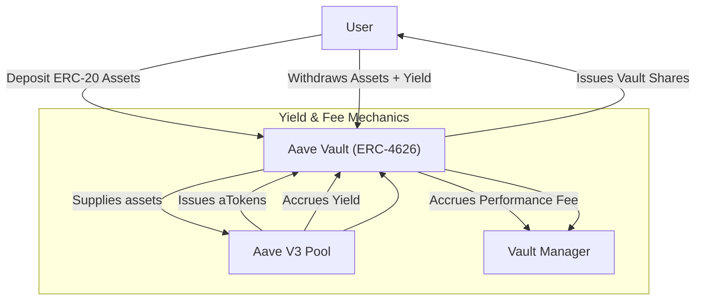

# What is Aave Vault?

## Introducing Aave Vault: Your Gateway to Tokenized Yield with Fee Management

Aave Vault is an innovative ERC-4626 tokenized vault designed to seamlessly integrate with Aave v3. It enables users to deposit and withdraw supported ERC-20 assets while earning yield through Aave's lending protocol. Importantly, it provides a manager-driven fee mechanism on the yield earned, giving vault managers a direct incentive tied to performance.

### Key Benefits of Aave Vault

- **Effortless Access to Aave's Yield:** Deposit your supported ERC-20 tokens and automatically earn yield via Aave v3’s lending pools without handling the underlying supply mechanics.
- **Tokenized Shares:** Each deposit mints tokenized shares representing a claim on the vault's underlying assets, simplifying ownership tracking and transfer.
- **Manager Fee on Yield:** Vault managers can set and collect fees based on yield earned, aligning interests between users and managers.
- **Robust Asset Support:** Supports all ERC-20 assets that Aave v3 currently supports, expanding opportunities across protocols.

### Who Should Use Aave Vault?

This vault is ideal for DeFi users who want to gain exposure to Aave’s yield generation, asset managers seeking to monetize vault performance through fees, and developers wanting composability via the ERC-4626 standard.

---

## What is Aave Vault?

At its core, Aave Vault is a smart contract-based vault compatible with the ERC-4626 tokenized vault standard, tailored for integration with Aave Protocol v3.

It acts as a custodian for deposits of ERC-20 tokens supported by Aave and manages the supply of those tokens to Aave, receiving yield in return. The vault transparently issues ERC-4626-compliant shares to depositors in exchange for their assets. Users can redeem their shares at any time for the underlying assets plus accrued yield minus applicable fees.

Unlike basic vaults, Aave Vault introduces a manager fee that is applied specifically on the yield earned. This capability allows vault operators to incentivize stewardship and actively reward vault management aligned with user interest.

### Core Purpose

- Enable users to efficiently deposit their ERC-20 tokens into Aave through a simple ERC-4626 interface.
- Simplify yield collection by managing the complexity of interacting with Aave internally.
- Facilitate fee accrual for vault managers on performance (yield).

### What Makes Aave Vault Different?

- **Fee on Yield, Not on Principal:** The vault only charges fees on the positive yield generated, thereby protecting depositors’ initial capital.
- **Full ERC-4626 Compatibility:** Ensures easy interoperability with DeFi protocols and tooling that support the ERC-4626 standard.
- **Supports Direct Deposit of aTokens:** Users have the option to deposit either the underlying ERC-20 tokens or the interest-bearing Aave aTokens.
- **Extensive Safety and Constraints:** Implements checks against Aave’s reserve limits, ensuring deposits and withdrawals conform to Aave’s supply caps and liquidity constraints.

---

## Key Features & Capabilities

- **Deposit & Mint:** Users can deposit the underlying asset or aTokens to mint vault shares representing their stake.
- **Withdraw & Redeem:** Users can withdraw the underlying assets or redeem shares for the underlying or aTokens.
- **Meta-Transaction Support:** Enables gasless transactions for deposits, withdrawals, and redemptions through EIP-712 signatures.
- **Fee Management:** Vault managers set fee parameters and withdraw accrued fees denominated in aTokens.
- **Reward Claiming:** Managers can claim Aave incentive rewards accrued from vault deposits directly.
- **Emergency Rescue:** Managers can rescue tokens accidentally sent to the vault, except the core aToken.
- **Supply Caps Enforcement:** All deposits are constrained by Aave’s dynamic supply caps and asset states (active, frozen, or paused).

### Real-World Scenario

Imagine Alice wants to earn yield on her DAI while avoiding the complexity of interacting with Aave’s lending pool directly. She deposits her DAI into Aave Vault, which supplies those DAI to Aave under the hood. As the vault accrues yield, Alice’s share value increases correspondingly. Meanwhile, the vault manager earns fees on the yield, incentivizing diligent management, while Alice can withdraw anytime easily.

---

## Why Should I Care?

Aave Vault transforms yield farming and asset management by merging ease of use, security, and manager incentives:

- **Simplify Yield Generation:** No need to interact directly with Aave; vault abstracts complexity.
- **Protect Capital:** Fees are only levied on yield, leaving principal intact.
- **Flexibility & Interoperability:** ERC-4626 compliance allows easy integration in broader DeFi strategies.
- **Incentivized Management:** Managers motivated to maximize yield due to fee on performance.

### Use Cases

- Users looking for hands-off yield accrual on assets supported by Aave.
- Asset or fund managers building yield-earning products with governance over fees.
- DeFi developers integrating tokenized yield vaults into larger composable financial systems.

### Before & After Adoption

| Without Aave Vault | With Aave Vault |
|--------------------|----------------|
| Manual supply/withdraw from Aave required | Easy deposits and withdrawals using ERC-4626 shares |
| No direct fee-on-yield integration | Vault manager earns on yield only |
| Complex asset and reward management | Streamlined yield accrual and fee collection |

---

## Getting Started Preview

Getting started with Aave Vault involves initializing the vault with an initial deposit and fee settings, then depositing supported ERC-20 tokens or aTokens.

### Prerequisites

- Ensure the asset you want to deposit is supported by Aave v3.
- Have an initial non-zero deposit ready for vault initialization.
- Vault manager permissions to set fees and withdraw accrued fees.

### Next Steps

- Explore the [Feature Overview](../architecture-feature-overview/feature-overview) page to learn all capabilities.
- Review the [Core Concepts & Terminology](../product-intro/core-concepts-terminology) to understand foundational terms.
- Proceed to [Deploying Aave Vault](../../deployment/deploying-the-vault/running-the-deployment-script) for deployment instructions.

---

For more details, dive into the source code or tests which implement and verify the vault’s deposit, withdrawal, and fee logic:

```solidity
// Example deposit function usage
function deposit(uint256 assets, address receiver) external returns (uint256 shares);
```

For comprehensive insights and all advanced functionalities, visit the official repository: [Aave Vault GitHub](https://github.com/aave/Aave-Vault).

---

## Visual Overview



This diagram illustrates the user depositing assets into the vault, which supplies them to Aave. Yield accrues in the form of aTokens, increasing the vault balance. The vault calculates fees on the yield and allows the manager to withdraw them.

---